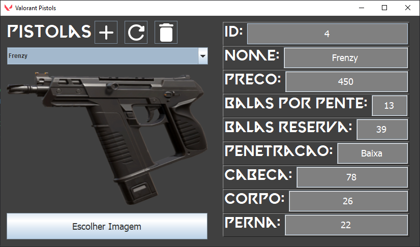

# Sistema de Registro ☕




> Sistema para adicionar, editar e excluir objetos de um banco de dados.

## 💻 Notas do Projeto
Valorant é um jogo de tiro em primeira pessoa que eu costumo jogar no dia-a-dia, então desenvolvi este projeto para registrar as armas que estão disponíveis no game, com a mesma base, é possível criar também qualquer sistema que crie, edite e exclua registros de um banco de dados de forma segura.

## ☕ Usando o Sistema de Registro
- Para utilizar o projeto basta clonar o repositório.
- No diretório "src/com/gabs/sql", está presente uma classe com o nome de "Conexão.java", onde estão todas as instruções SQL guardadas no projeto.

- Um exemplo:
```java
public String insertObject() {
	return "INSERT INTO weapons(name, price,wall_penetration, balas_por_pente, balas_reserva, head, body, leg, image)" + "values(?,?,?,?,?,?,?,?,?)";
}
```

O primeiro método da classe principal, presente em "src/com/gabs/main/MainWindow.java", é o método com a conexão do SQL, você pode fazer a alteração e o link com o seu banco de dados através da alteração dos argumentos do DriverManager:
```java
public Connection getConnection() {
	try {
		Connection cn = DriverManager.getConnection("jdbc:mysql://localhost:3306/objects", "root", "");
		System.out.println("Conectado!");
		return cn;
	}catch(SQLException e) {
		e.printStackTrace();
		return null;
	}
}
 ```
